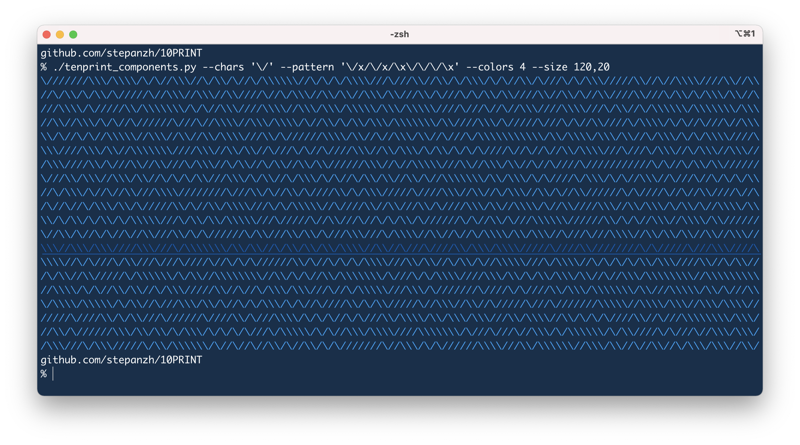

# 10PRINT
Generative art experiments around 10 PRINT algorithm of maze generation.

For the experiments see https://stepanzh.github.io/10PRINT/.

Useful materials

- [About 10 PRINT algorithm](https://10print.org/);
- [Great article about ansi escape codes](https://www.lihaoyi.com/post/BuildyourownCommandLinewithANSIescapecodes.html).
